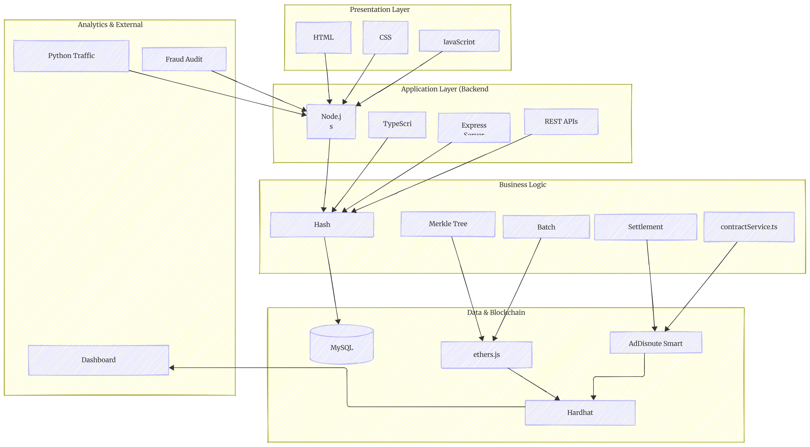
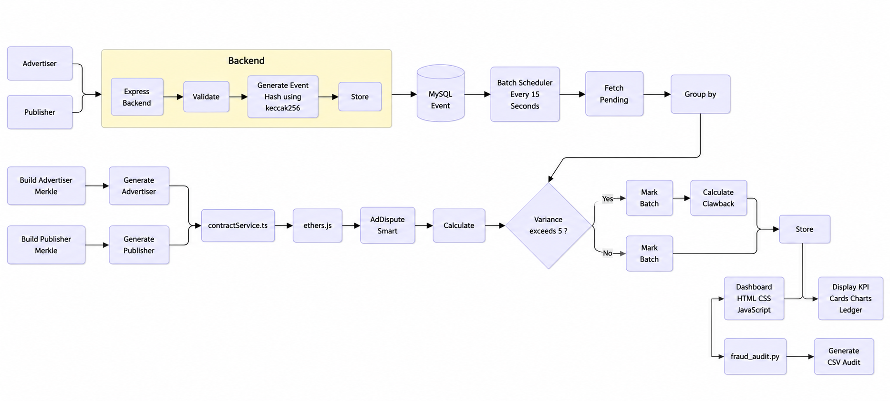
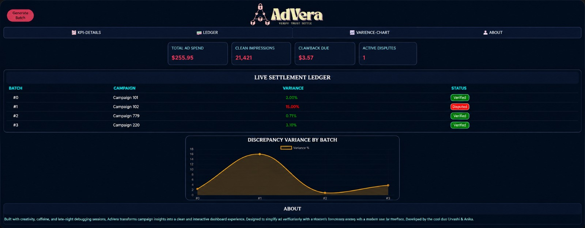
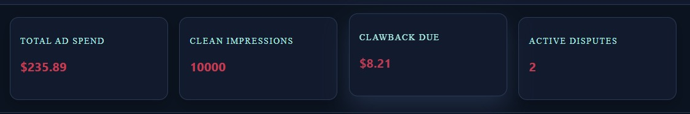
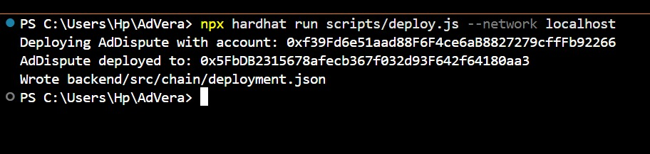
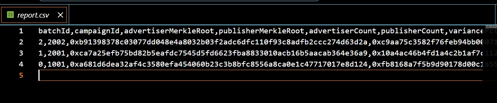
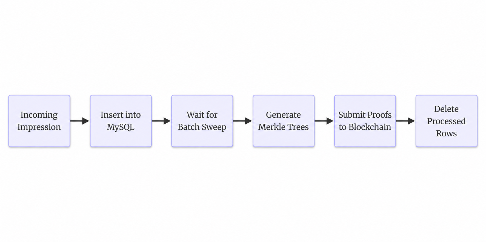
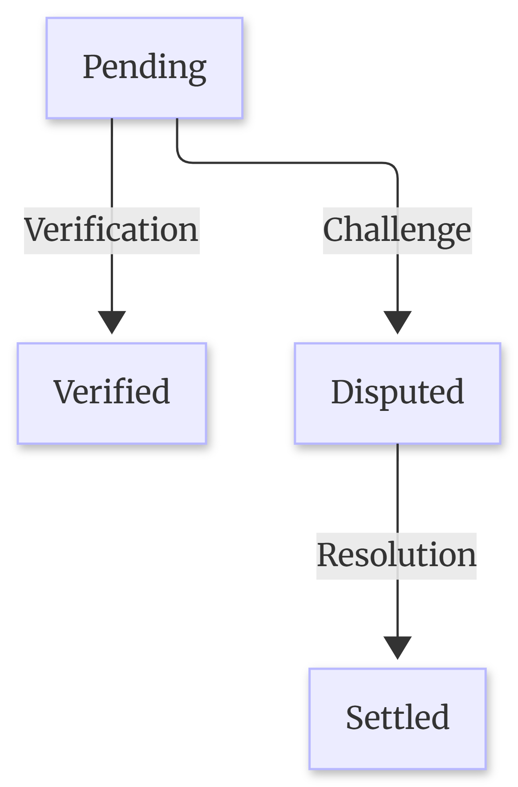

# 
### *Blockchain-based advertising fraud detection system*


<br>


---

# Table of Contents

1. [About AdVera](#1-about-advera)
2. [Problem Statement](#2-problem-statement)
3. [Solution Overview](#3-solution-overview)
4. [Objectives](#4-objectives)
5. [Key Features](#5-key-features)
6. [How AdVera Works](#6-how-advera-works)
7. [System Architecture](#7-system-architecture)
8. [Blockchain Integration](#8-blockchain-integration)
9. [Component Boundaries Diagram](#9-component-boundaries-diagram)
10. [Workflow Diagram](#10-workflow-diagram)
11. [Tech Stack](#11-tech-stack)
12. [Project Structure](#12-project-structure)
13. [Installation](#13-installation)
14. [Environment Variables](#14-environment-variables)
15. [Running the Project](#15-running-the-project)
16. [Usage Guide](#16-usage-guide)
17. [Screenshots](#17-screenshots)
18. [API Documentation](#18-api-documentation)
19. [Database Design](#19-database-design)
20. [Smart Contract Details](#20-smart-contract-details)
21. [Security Measures](#21-security-measures)
22. [Performance](#22-performance)
23. [Challenges Faced](#23-challenges-faced)
24. [Future Scope](#24-future-scope)
25. [Contributors](#25-contributors)
26. [Acknowledgements](#26-aknowledgements)
27. [Contact](#27-contact)

---

# 1. About AdVera

Today, digital advertising runs on one simple question:
**"How many times was this advertisement actually shown?"**

When an advertisement is displayed, both the **advertiser** (the company paying for the campaign) and the **publisher** (the website or platform showing the ad) maintain their own records of impressions. Ideally, both counts should match. In reality, they often don't.
Sometimes the mismatch is caused by delayed reporting or technical issues. Other times it can be the result of fraudulent activity, such as fake impressions generated by bots or inflated reporting.
AdVera is a prototype system that makes these reports tamper-resistant.Instead of asking either party to trust the other's numbers, AdVera lets both sides independently submit cryptographic proofs (hashes) of their impression data. Those proofs are compared automatically on a blockchain, which calculates the difference between the reported counts and immediately flags suspicious batches. The raw impression data never leaves the backend. Only compact cryptographic proofs are stored on-chain, keeping the system lightweight while preserving privacy.
The entire project runs locally on a single machine using only **two terminal windows**, making it easy to understand, test, and demonstrate without requiring cloud infrastructure.

---

# 2. Problem Statement

Digital advertising is a multi-billion-dollar industry, yet much of it still depends on trust. Every advertising campaign involves multiple parties. Advertisers pay for impressions they believe were delivered, while publishers report how many impressions they served. Since each side maintains its own records, disagreements are common.

Today's systems usually rely on centralized ad exchanges that receive reports from both parties. When those reports don't match, resolving the dispute often requires manual investigation.The situation becomes even worse when ad fraud enters the picture.Fake impressions generated by bots cost the advertising industry billions of dollars every year. These fraudulent impressions increase publisher counts without representing real users, causing advertisers to spend money on traffic that never existed.

The biggest problem is that there is no shared, verifiable record that both parties agree on. Without cryptographic proof, disputes become slow, expensive, and difficult to resolve. Smaller publishers are especially vulnerable because they often lack the resources to challenge fraudulent disputes raised against them.
A better system should replace trust with verifiable evidence.

---

# 3. Solution Overview

AdVera replaces trust with cryptographic verification. Instead of comparing raw impression logs, the system transforms each impression into a deterministic cryptographic hash. These hashes are aggregated into Merkle trees, which produce a compact root hash that represents the full batch of events.

Only the Merkle Root is written to the blockchain. This means the blockchain does not store raw impression records, user identifiers, or IP addresses. It stores only a single commitment hash that represents the complete dataset.

### Batch Processing
In AdVera, a batch is a collection of impression events accumulated over a fixed time window or until a threshold is reached. Rather than sending every impression to the blockchain individually, the backend groups them into batches, processes them together, and generates a Merkle tree for each side of the campaign. 
This approach reduces on-chain load while still preserving a verifiable record of all impressions.

### Data Submitted to the Smart Contract
After each batch sweep(a scheduled process that collects pending impression data and settles it together), the backend submits:<br>
* Advertiser Merkle Root<br>
* Publisher Merkle Root<br>
* Advertiser impression count<br>
* Publisher impression count<br>
* Campaign ID<br>
to the smart contract.

The <code>AdDispute.sol</code> smart contract automatically compares both counts, computes the percentage variance, and classifies the batch.

### If the variance:
- remains within the configured threshold (5% by default), the batch is marked Verified.
- exceeds the threshold, the contract marks it as Disputed and automatically calculates a proportional clawback penalty.

No manual intervention is required for the initial fraud detection.Most processing happens off-chain for performance. The blockchain stores only the proof required to validate the result.

---

# 4. Objectives

AdVera was built with a few clear goals in mind.

* Build a working fraud-detection pipeline using Merkle trees and blockchain settlement instead of a theoretical demonstration.
* Keep the entire project simple enough to run on a single developer machine.
* Replace Redis with MySQL to reduce infrastructure while maintaining a durable event queue.
* Demonstrate the complete fraud-detection workflow from impression collection to blockchain settlement.
* Simulate both legitimate and fraudulent advertising traffic to verify that the detection logic behaves correctly.
* Present blockchain settlement results through a live dashboard that translates technical data into meaningful business metrics such as ad spend, disputes, and clawbacks.

---

# 5. Key Features

### 1) Dual-Sided Merkle Proofs
Both advertisers and publishers independently submit hashed impression events. Neither party can modify or overwrite the other's data.

### 2) On-Chain Automatic Settlement
Every completed batch is submitted to the `AdDispute` smart contract. The contract calculates the variance and determines whether the batch should be marked as **Verified** or **Disputed** in a single transaction.

### 3) Configurable Variance Threshold
By default, batches with less than 5% variance are accepted as **Verified**. Larger discrepancies are automatically flagged and assigned a proportional penalty. 
For this prototype, 5% was chosen because it:
* Is easy to explain during demonstrations.
* Allows small, genuine differences to pass.
* Clearly detects simulated fraud where discrepancies are much larger.
* Is a commonly used tolerance in reconciliation systems. 
Overall, it's a reasonable default, but not a fixed industry standard.Hence, the threshold can be changed if required.

### 4) MySQL-Backed Event Queue
Incoming impression events are immediately stored in a MySQL `events` table. A scheduled batch sweep periodically collects pending events, builds Merkle trees, and removes processed rows from the queue.

### 5) Python Fraud Simulator
A standalone Python tool generates both normal advertising traffic and bot-inflated publisher traffic, making it easy to demonstrate how fraud affects settlement.

### 6) Independent Audit Script
Another Python utility communicates only with the backend API and produces a human-readable audit report showing verified batches, disputed batches, and clawback percentages.

### 7) Live Dashboard 
A simple dashboard built with **HTML**, **CSS**, and **JavaScript** polls the backend every few seconds to display:
* Total Ad Spend
* Verified Impressions
* Clawback Due
* Active Disputes
* Settlement Ledger
* Variance Chart

### 8) Two-Terminal System
The entire prototype runs using only two terminal windows.
* Terminal 1 runs the local Hardhat blockchain.
* Terminal 2 runs the Express backend.

---

# 6. How AdVera Works

Here's how a single batch moves through the system.

### Step 1 — An Advertisement is Displayed
When an advertisement is shown, the advertiser's SDK sends a request to:
```http
POST /track/advertiser-side
```
The request contains:
* adId
* campaignId
* hashed IP address

### Step 2 — Publisher Reports the Same Impression
The publisher independently sends its own record to:
```http
POST /track/publisher-side
```
using the same fields.
Since both parties submit data separately, neither side depends on the other's reporting.

### Step 3 — Events are Hashed
Each event is converted into a Keccak-256 hash.
Instead of storing sensitive information directly, only the hash of the event is kept.
These hashes are written into the MySQL **events** table.

### Step 4 — Batch Sweep
Every **15 seconds** (configurable), the backend checks for pending events.
For every active campaign it:
* Reads advertiser events
* Reads publisher events
* Removes processed rows
* Builds one advertiser Merkle Tree
* Builds one publisher Merkle Tree

### Step 5 — Blockchain Submission
Only five pieces of information are submitted to the blockchain:
* Advertiser Merkle Root
* Publisher Merkle Root
* Advertiser Count
* Publisher Count
* Campaign ID
The raw impression data never leaves the backend.

### Step 6 — Automatic Settlement
The smart contract calculates:
```
variance = (|advertiserCount - publisherCount| / advertiserCount) × 100
```
If the variance exceeds 5%, the batch becomes **Disputed** and receives a proportional penalty.

Otherwise, it is marked **Verified**.

### Step 7 — Dashboard Updates (live)
The frontend periodically requests:
```http
GET /api/batches
```
The latest settlement data is displayed automatically on the dashboard without requiring a page refresh.

---

# 7. System Architecture

AdVera follows a **Hybrid Blockchain Architecture**, combining the efficiency of a traditional centralized backend with the transparency and immutability of blockchain technology.

Unlike applications that store every transaction directly on the blockchain, AdVera performs computationally intensive tasks such as request handling, event processing, database operations, and Merkle tree generation off-chain. Only the final cryptographic proofs and settlement information are submitted to the blockchain for permanent verification.

This hybrid approach provides the best of both worlds- Centralized computing + Blockchain technology as security:
* **High performance** through centralized processing.
* **Low blockchain storage costs** by recording only cryptographic proofs.
* **Tamper-resistant settlement** through smart contracts.
* **Scalability**, since thousands of impressions can be represented by a single Merkle root.

Thus, instead of storing every advertisement impression on the blockchain, AdVera uses the blockchain only to verify and record the final settlement.


### Working of the entire architecture
Each layer in the architecture has a clearly defined responsibility.

**1) Frontend**<br>
The dashboard is built using **HTML, CSS, and JavaScript**.
It allows users to:
- Monitor campaign statistics
- View settlement results
- Track disputed batches
- Observe clawback calculations
- Generate new batches
The frontend never communicates directly with the blockchain. Instead, it interacts only with the backend through REST APIs.

**2) REST API**<br>
The REST API acts as the communication bridge between the user interface and the backend services.It accepts advertiser and publisher impression events, while also exposing endpoints that return settlement history and dashboard statistics.
This separation keeps the frontend lightweight and hides blockchain implementation details from the user.

**3) Express Backend**<br>
The Express backend serves as the core processing engine of AdVera.
Its responsibilities include:
- Receiving impression events
- Validating incoming requests
- Storing pending events in MySQL
- Generating Keccak-256 hashes
- Building Merkle Trees
- Running scheduled batch sweeps
- Communicating with the blockchain
Almost all computation happens here because these operations are significantly faster and less expensive than executing them on-chain.

**4) ethers.js**<br>
Rather than interacting directly with blockchain nodes, the backend uses **ethers.js** as a blockchain communication layer. ethers.js signs transactions using the configured gateway wallet and invokes functions on the deployed smart contract.
This abstraction keeps blockchain interaction simple while allowing the backend to remain independent of the underlying network.

**5) Hardhat Blockchain**<br>
During development, AdVera uses a local Hardhat blockchain.
Hardhat provides:
- Instant transaction confirmation
- Deterministic test accounts
- No transaction fees
- Easy contract deployment
This makes the project ideal for demonstrations, testing, and development as a prototype

**6) Smart Contract**<br>
The `AdDispute` smart contract forms the trust layer of the architecture.
Instead of processing every impression, it receives only:
- Advertiser Merkle Root
- Publisher Merkle Root
- Impression Counts
- Campaign ID
The contract then:
- Calculates variance
- Determines whether the batch is **Verified** or **Disputed**
- Computes the clawback penalty
- Stores the immutable settlement record
Because every settlement is written to the blockchain, neither advertisers nor publishers can modify the outcome after submission.


### Why a Hybrid Blockchain Architecture?
Storing every advertisement impression directly on a blockchain would be expensive, slow, and impractical.
AdVera solves this by dividing responsibilities between centralized and decentralized components.
The centralized backend performs high-volume data processing efficiently, while the blockchain records only the cryptographic evidence required to verify the settlement.
This significantly reduces blockchain storage requirements while preserving transparency and trust.
Many blockchain projects attempt to move their entire application on-chain. AdVera takes a different approach.
Instead of replacing traditional infrastructure, it **integrates blockchain only where trust is required**.
The result is a practical architecture where:
- High-frequency operations remain fast and scalable.
- Sensitive impression data stays off-chain.
- Only cryptographic proofs are permanently recorded.
- Settlement decisions become transparent, auditable, and tamper-resistant.
This hybrid design demonstrates how blockchain can complement existing systems rather than replace them, making AdVera both efficient and trustworthy.

---

# 8. Blockchain Integration

AdVera uses a **local Hardhat blockchain** during development. Because everything runs locally, there is no need for MetaMask, testnet tokens, or external blockchain infrastructure.

The `AdDispute.sol` contract is deployed once. During deployment, the contract address and ABI are automatically written to:
```
backend/src/chain/deployment.json
```

The backend connects to the blockchain using **ethers.js** and a wallet created from Hardhat Account #0. (first account)
The contract exposes three primary functions used by the backend:

| Function              | Purpose                                             |
| --------------------- | ---dit this part now------------------------------------------------ |
| `submitBatchProofs()` | Stores a completed batch on-chain after every sweep |
| `getBatch(batchId)`   | Returns metadata for a specific batch               |
| `getBatchCount()`     | Returns the total number of settled batches         |

To prevent unauthorized submissions, only approved backend wallets can call `submitBatchProofs()` through the `onlyGateway` modifier.

The contract owner can authorize or revoke gateway wallets using:
```solidity
setGateway()
```
dit this part now
The dispute threshold is configurable through:
```solidity
setDisputeThreshold()
```

By default, the threshold is **500**, representing **5.00%** using scaled integer arithmetic.
Penalty values are capped at **5000 basis points (50%)**, regardless of how large the variance becomes.

---

# 9. Component Boundaries Diagram


> **The component boundaries diagram illustrates how AdVera is divided into independent modules, each with a well-defined responsibility.**

---

# 10. Workflow Diagram


> **The workflow above illustrates how an advertisement impression flows through AdVera, from its initial capture to its final settlement on the blockchain.
> When an advertiser or publisher generates an impression, the frontend sends the data to the Express backend through REST APIs. The backend validates the request, stores the event in MySQL, and periodically groups pending impressions into batches. For each batch, Keccak-256 hashes are generated and combined into Merkle Trees, producing compact cryptographic proofs. These proofs are then submitted to the `AdDispute` smart contract on the Hardhat blockchain using `ethers.js`.
> The smart contract compares the advertiser and publisher impression counts, calculates the variance, determines whether the batch is **Verified** or **Disputed**, computes any applicable clawback penalty, and permanently records the settlement on the blockchain. Finally, the frontend retrieves the updated settlement information through the REST API and displays it on the dashboard, providing users with a transparent and tamper-resistant view of campaign results.**

---

# 11. Tech Stack

AdVera combines modern web technologies with blockchain to create a transparent and tamper-resistant advertising settlement system. Each technology was selected for a specific purpose, balancing performance, simplicity, and security.

| Category | Technology |
|-----------|------------|
| **Frontend** | HTML5, CSS3, Vanilla JavaScript |
| **Backend** | Node.js, Express.js, TypeScript |
| **Database** | MySQL |
| **Blockchain** | Solidity, Hardhat, ethers.js |
| **Cryptography** | MerkleTreeJS, Keccak-256 |
| **API** | REST API |
| **Fraud Simulation & Audit** | Python, Pandas, Requests |
| **Configuration** | dotenv |
| **Development Tools** | ts-node-dev, npm |

---

# 12. Project Structure

The project is divided into separate modules for blockchain, backend services, frontend interface, and fraud simulation. This modular structure keeps each component independent, making the project easier to understand, maintain, and extend.


### Directory Overview
| Directory | Description |
|------------|-------------|
| **contracts/** | Contains the Solidity smart contract responsible for settlement and dispute detection. |
| **scripts/** | Deployment and blockchain interaction scripts. |
| **backend/** | Express backend, MySQL integration, Merkle tree generation, and blockchain communication. |
| **frontend/** | User dashboard built with HTML, CSS, and Vanilla JavaScript. |
| **audit/** | Python scripts used to simulate traffic and audit settlement results. |


```text
AdVera/
│
├── contracts/
│   └── AdDispute.sol              # Smart contract for settlement and dispute handling
│
├── scripts/
│   ├── deploy.js                  # Deploys the smart contract
│   └── addBatch.js                # Adds sample settlement batches
│
├── backend/
│   ├── src/
│   │   ├── index.ts               # Express server entry point
│   │   ├── db.ts                  # MySQL database operations
│   │   ├── merkle.ts              # Merkle tree generation
│   │   └── contractService.ts     # Smart contract interaction using ethers.js
│   │
│   ├── server.js                  # Backend startup script
│   ├── package.json
│   └── tsconfig.json
│
├── frontend/
│   ├── index.html                 # Dashboard UI
│   ├── cardflip.css               # Dashboard styling
│   ├── script.js                  # Frontend logic
│   └── image.png                  # Project assets
│
├── audit/
│   ├── traffic_simulator.py       # Simulates advertiser & publisher traffic
│   ├── fraud_audit.py             # Generates fraud reports
│   └── report.csv                 # Sample audit report
│
├── hardhat.config.js              # Hardhat configuration
├── package.json                   # Root dependencies
└── README.md
```

---

# 13. Installation

Follow these steps to run AdVera on your local machine.

### Prerequisites
Before starting, ensure the following software is installed.
| Software | Recommended Version |
|----------|---------------------|
| Node.js | 18+ |
| npm | Latest |
| Python | 3.10+ |
| MySQL | 8.0+ |
| Git | Latest |

**Step 1 — Clone the Repository**<br>
Run in: Command Prompt / PowerShell / Terminal
```bash
git clone https://github.com/<your-username>/AdVera.git
cd AdVera
```
This places you inside the project's root directory.

**Step 2 — Install Root Dependencies**<br>
Current directory:
```text
AdVera/
```
Install the Hardhat dependencies.
```bash
npm install
```

**Step 3 — Install Backend Dependencies**<br>
Move into the backend folder.
```bash
cd backend
```
Current directory:
```text
AdVera/backend/
```
Install backend packages.
```bash
npm install
```
This installs:<br>
- Express.js
- ethers.js
- mysql2
- dotenv
- merkletreejs
- keccak256
- TypeScript
- ts-node-dev

**Step 4 — Install Frontend Dependencies**<br>
Although the frontend is built using HTML, CSS, and JavaScript, install the project dependencies if present.
Return to the project root.
```bash
cd ..
```
Move into the frontend folder.
```bash
cd frontend
```
Current directory:
```text
AdVera/frontend/
```
Install frontend packages.
```bash
npm install
```

**Step 5 — Install Python Dependencies**<br>
Return to the project root.
```bash
cd ..
```
Move into the audit folder.
```bash
cd audit
```
Current directory:
```text
AdVera/audit/
```
Create a virtual environment.
```bash
python -m venv venv
```
Activate it.<br>
**1. Windows**<br>
```powershell
venv\Scripts\activate
```
OR <br>
**2. Linux / macOS**<br>
```bash
source venv/bin/activate
```
Install the required Python libraries.
```bash
pip install pandas requests
```

**Step 6 — Configure MySQL**<br>
Open MySQL Workbench (or any MySQL client) and create a new database.
```sql
CREATE DATABASE advera;
```
Update your database credentials inside:
```text
AdVera/backend/.env
```
before starting the backend.

---

# 14. Environment Variables

Inside the **backend** folder, create a file named:<br>
```text
.env
```
Add the following configuration.
```env
PORT=4000

RPC_URL=http://127.0.0.1:8545

PRIVATE_KEY=<Hardhat Account #0 Private Key>

DB_HOST=localhost
DB_PORT=3306
DB_USER=root
DB_PASSWORD=your_password
DB_NAME=advera

BATCH_INTERVAL_MS=15000
```

### Environment Variable Description
| Variable | Purpose |
|-----------|----------|
| `PORT` | Port on which the Express server runs. |
| `RPC_URL` | Local Hardhat blockchain endpoint. |
| `PRIVATE_KEY` | Wallet used to submit settlement transactions. |
| `DB_HOST` | MySQL server hostname. |
| `DB_PORT` | MySQL server port. |
| `DB_USER` | Database username. |
| `DB_PASSWORD` | Database password. |
| `DB_NAME` | Database containing impression events. |
| `BATCH_INTERVAL_MS` | Interval between automatic settlement batches. |

---


| Component       | Open Where? | Directory          | Command                                                 |
| --------------- | ----------- | ------------------ | ------------------------------------------------------- |
| Blockchain      | Terminal 1  | `AdVera/`          | `npx hardhat node`                                      |
| Deploy Contract | Terminal 2  | `AdVera/`          | `npx hardhat run scripts/deploy.js --network localhost` |
| Backend         | Terminal 2  | `AdVera/backend/`  | `npm run dev`                                           |
| Fraud Simulator | Terminal 3  | `AdVera/audit/`    | `python traffic_simulator.py`                           |
| Frontend        | Browser     | `AdVera/frontend/` | Open `index.html`                                       |


---

# 15. Running the Project

AdVera runs using **two terminal windows**.

### Terminal 1 — Start the Local Blockchain

Open a **new Command Prompt / Terminal**.<br>
Navigate to the project root.
```bash
cd path/to/AdVera
```
Current directory:
```text
AdVera/
```
Start Hardhat.
```bash
npx hardhat node
```
Keep this terminal running throughout the demonstration.


**Terminal 1A- Deploy the Smart Contract**<br>
Open **another terminal**.<br>
Navigate to the project root again.
```bash
cd path/to/AdVera
```
Compile the contract.
```bash
npx hardhat compile
```
Deploy it.
```bash
npx hardhat run scripts/deploy.js --network localhost
```
The deployed contract address will be displayed in this terminal.

### Terminal 2 — Start the Backend

Using the **same terminal** after deployment (or open another one):
Navigate to:
```bash
cd backend
```
Current directory:
```text
AdVera/backend/
```
Run the backend.
```bash
npm run dev
```
or, if your project starts with:
```bash
node server.js
```
then use:
```bash
node server.js
```
Leave this terminal running.


**Terminal 2A- Run the Traffic Simulator**<br>
Open **another Command Prompt**.<br>
Navigate to:
```bash
cd path/to/AdVera/audit
```
Activate the virtual environment.<br>
**1. Windows:**<br>
```powershell
venv\Scripts\activate
```
OR<br>
**2. Linux/macOS:**<br>
```bash
source venv/bin/activate
```
Generate normal traffic.
```bash
python traffic_simulator.py
```
or fraudulent traffic.
```bash
python traffic_simulator.py --mode fraud
```

### Launch the Frontend

Navigate to:
```text
AdVera/frontend/
```
Simply open
```text
index.html
```
in your preferred browser.
Alternatively, you can serve it locally.
```bash
npx serve .
```
and open the displayed localhost URL.
The dashboard will automatically fetch settlement data from the backend using REST APIs.

---

# 16. Usage Guide

The easiest way to test the system is by using the Python traffic simulator included in the `audit/` directory. It can generate both legitimate advertising traffic and bot-inflated fraudulent traffic, allowing you to verify that the blockchain settlement logic behaves exactly as expected.

### Step 1 — Activate the Python Virtual Environment
Navigate to the `audit/` directory.
**1. Linux / macOS** <br>
```bash
source venv/bin/activate
```
OR <br>
**Windows** <br>
```powershell
venv\Scripts\activate
```

### Step 2 — Simulate a Legitimate Campaign
Run the following command to generate normal advertiser and publisher impressions for Campaign **2001**.
```bash
python traffic_simulator.py --campaign 2001 --mode normal --events 200
```
This generates approximately matching impression counts on both sides.
After the next batch sweep, the smart contract should classify this batch as:<br>
```text
Verified
```

### Step 3 — Simulate Fraudulent Traffic
Now generate bot-inflated publisher traffic.
```bash
python traffic_simulator.py --campaign 2002 --mode fraud --events 200 --bots 1500
```
In this case, the publisher intentionally reports far more impressions than the advertiser.
During the next batch sweep, AdVera will detect that the variance exceeds the configured 5% threshold.
The batch will automatically be classified as:<br>
```text
Disputed
```
and a proportional clawback penalty will be calculated.

### Step 4 — Wait for the Batch Sweep
The backend performs settlement every:<br>
```text
15 seconds
```
(default development configuration).
Simply wait around **15–20 seconds** after generating traffic.

### Step 5 — Generate an Audit Report
Once settlement has completed, run the independent audit script.
```bash
python fraud_audit.py --out report.csv
```
The script communicates only with the backend API and generates a CSV report summarizing all settled batches.
A typical report includes:<br>
- Campaign ID
- Advertiser Count
- Publisher Count
- Variance Percentage
- Batch Status
- Penalty (Basis Points)
- Settlement Timestamp

### Expected Outcome example
| Campaign | Expected Result |
|----------|-----------------|
| **2001** | ✅ Verified |
| **2002** | ⚠️ Disputed with a non-zero clawback percentage |

If the frontend dashboard is open, these updates will appear automatically(live)  without refreshing the page.

---

# 17. Screenshots

### Dashboard Overview

> **The main dashboard provides a real-time overview of advertising campaign settlements. It displays key performance indicators such as **Total Ad Spend**, **Verified Impressions**, **Clawback Due**, and **Active Disputes**, along with a settlement ledger and variance analysis chart.**

### Disputed Batch Example

> **This screenshot shows a campaign whose impression variance exceeded the configured **5% dispute threshold**. The batch is automatically marked as **Disputed**, and the calculated clawback penalty is displayed in the settlement ledger.**

### Audit Report

> **The Python-based audit tool generates a report summarizing all settled batches. The report includes campaign IDs, advertiser and publisher impression counts, calculated variance, settlement status, penalties, and timestamps for independent verification.**

### Smart Contract Deployment

> **Shows the successful deployment of the `AdDispute` smart contract to the local Hardhat blockchain.**

### Traffic Simulation

> **Illustrates the execution of the Python traffic simulator used to generate both legitimate and fraudulent advertisement impressions.**

---

# 18. API Documentation

The backend exposes a small REST API for tracking impressions and retrieving settlement results.

### Endpoints
| Method | Endpoint | Description |
|----------|----------|-------------|
| **POST** | `/track/advertiser-side` | Record an advertiser-side impression |
| **POST** | `/track/publisher-side` | Record a publisher-side impression |
| **GET** | `/api/batches` | Return all settled batches from the blockchain |
| **GET** | `/api/batches/count` | Return the total number of settled batches |

### Tracking Request Body
Both tracking endpoints accept the same request format.
```json
{
  "adId": "ad1",
  "campaignId": "1001",
  "ipHash": "abc123def456",
  "timestamp": 1712345678000
}
```
| Field | Description |
|---------|-------------|
| `adId` | Advertisement identifier |
| `campaignId` | Campaign identifier |
| `ipHash` | Hashed client IP address |
| `timestamp` | Optional Unix timestamp in milliseconds. Defaults to `Date.now()` if omitted. |


**Example Response —** `/api/batches` <br>

```json
[
  {
    "batchId": 0,
    "campaignId": 1001,
    "advertiserMerkleRoot": "0xabc...",
    "publisherMerkleRoot": "0xdef...",
    "advertiserCount": 200,
    "publisherCount": 198,
    "variancePct": 1.0,
    "status": "Verified",
    "timestamp": 1712345678,
    "penaltyBasisPoints": 0
  }
]
```
| Field | Description |
|----------|-------------|
| `batchId` | Unique blockchain batch identifier |
| `campaignId` | Campaign associated with the batch |
| `advertiserMerkleRoot` | Merkle root generated from advertiser impressions |
| `publisherMerkleRoot` | Merkle root generated from publisher impressions |
| `advertiserCount` | Number of advertiser impressions |
| `publisherCount` | Number of publisher impressions |
| `variancePct` | Calculated percentage difference |
| `status` | `Verified` or `Disputed` |
| `timestamp` | Settlement timestamp |
| `penaltyBasisPoints` | Calculated clawback penalty |

---

# 19. Database Design

AdVera uses **MySQL** as a durable event queue.
Every incoming impression is inserted into the `events` table immediately after it is received. The backend periodically reads pending events, builds Merkle trees, submits settlement proofs to the blockchain, and removes the processed rows.
This means the table contains **only pending impressions** waiting to be settled.

### Table Schema
```sql
CREATE TABLE IF NOT EXISTS events (
    id INT AUTO_INCREMENT PRIMARY KEY,
    campaignId VARCHAR(64) NOT NULL,
    side ENUM('advertiser','publisher') NOT NULL,
    leaf VARCHAR(66) NOT NULL,
    createdAt BIGINT NOT NULL,
    INDEX idx_campaign_side (campaignId, side)
);
```
**Column Description** <br>
| Column | Description |
|---------|-------------|
| `id` | Auto-incrementing primary key |
| `campaignId` | Campaign associated with the impression |
| `side` | Indicates whether the event came from the advertiser or publisher |
| `leaf` | Keccak-256 hash of `adId:ipHash:timestamp` |
| `createdAt` | Unix timestamp (milliseconds) recording when the event was received |

### Why Store Only Hashes?
Instead of storing raw impression details on-chain, each event is first converted into a cryptographic hash.
```text
leaf = keccak256(adId : ipHash : timestamp)
```
Because only the hash is stored:
- User information is never written to the blockchain.
- Original impression data cannot be reconstructed from the hash.
- The backend can later combine thousands of hashes into a single Merkle root for blockchain settlement.

### Event Lifecycle

> **The `events` table behaves like a queue. Rows remain in the table only until they have been included in a blockchain batch.**

### Database Optimization
A composite index is created on:
```sql
(campaignId, side)
```
This allows the backend to quickly retrieve advertiser and publisher events for a campaign, even when the table contains thousands of pending impressions.
Because processed rows are removed immediately after settlement, the table stays compact and sweep operations remain efficient.

---

# 20. Smart Contract Details

At the heart of AdVera is the `AdDispute` smart contract. Its responsibility is simple: receive cryptographic proofs from both the advertiser and publisher, compare their reported impression counts, determine whether the batch is trustworthy, and record the result on the blockchain.

Unlike a traditional database, the smart contract provides an immutable settlement record that neither party can modify after submission.

### Contract Information
| Property | Value |
|----------|-------|
| **Contract Name** | `AdDispute` |
| **Language** | Solidity 0.8.24 |
| **Development Network** | Hardhat Local Blockchain |
| **Chain ID** | `31337` |
| **RPC Endpoint** | `http://127.0.0.1:8545` |

** What Does the Contract Store?**
The contract does **not** store every individual advertisement impression.Instead, it stores only the information required to verify a completed batch.
Each settled batch contains:<br>
- Campaign ID
- Advertiser Merkle Root
- Publisher Merkle Root
- Advertiser Impression Count
- Publisher Impression Count
- Variance Percentage
- Settlement Status
- Penalty (Basis Points)
- Settlement Timestamp
Because only Merkle roots are stored, thousands of impressions can be represented by only two hashes.

### BatchMetadata Structure
Every processed batch is stored inside a `BatchMetadata` structure.
Conceptually, it looks like this:<br>
```solidity
struct BatchMetadata {
    bytes32 advertiserMerkleRoot;
    bytes32 publisherMerkleRoot;

    uint256 advertiserCount;
    uint256 publisherCount;

    uint256 variancePct;
    uint256 penaltyBasisPoints;

    Status status;

    uint256 timestamp;
}
```
This single structure contains everything required to audit a completed settlement.

### Batch Lifecycle


> **Each batch can move through the above mentioned (possible) states-**

**1) Pending**<br>
A batch has been submitted but has not yet been evaluated.

**2) Verified**<br>
The difference between advertiser and publisher counts stays below the configured threshold.
No penalty is applied.

**3) Disputed**<br>
The variance exceeds the allowed threshold. 
The smart contract automatically calculates a proportional clawback penalty.

**4) Settled**<br>
A disputed batch can later be manually settled by the contract owner after review.

### Variance Calculation
The contract compares advertiser and publisher counts using scaled integer arithmetic.
Since Solidity does not support floating-point numbers, percentages are stored as integers.
The formula is:
```text
variancePct =
(| advertiserCount - publisherCount |/advertiserCount)× 10000
```
The multiplication by **10000** preserves two decimal places of precision.
For example,
```
Advertiser Count = 1000

Publisher Count = 1080

Difference = 80

Variance = 80 × 10000 / 1000

Variance = 800
```
A value of **800** represents:

```text
8.00%
```

### Dispute Threshold
The default dispute threshold is:
```text
500
```
which represents:
```text
5.00%
```
using the same scaled representation.

If
```text
variancePct > disputeThreshold
```
the batch becomes **Disputed**.
Otherwise, it is immediately marked **Verified**.

### Penalty Calculation
Once a batch is disputed, the contract calculates a clawback penalty.
The penalty is based on how much the variance exceeds the configured threshold.
Conceptually,
```text
Penalty = Variance − Threshold
```
The result is stored in **basis points**.
To prevent unrealistic penalties, the value is capped at:
```text
5000
```
or<br>
```text
50%
```
Even if a publisher reports an extremely inflated impression count, the penalty never exceeds the configured maximum.

### Access Control

The contract uses two levels of authorization.
1) onlyOwner
Administrative functions are restricted to the contract owner.
These include:
- Authorizing gateways
- Removing gateways
- Updating the dispute threshold
- Settling disputed batches

2) onlyGateway
The backend submits settlement proofs using:
```solidity
submitBatchProofs()
```
This function is protected by the `onlyGateway` modifier.
Only approved backend wallets can submit batches.
This prevents arbitrary users from creating fake settlements.

## Events Emitted
Whenever important actions occur, the contract emits blockchain events.
| Event | Purpose |
|---------|----------|
| `BatchSubmitted` | A new batch has been recorded |
| `BatchSettled` | A disputed batch has been settled |
| `GatewayAuthorized` | A gateway wallet has been added or removed |

These events make it possible to build dashboards, monitoring tools, or external analytics without modifying the contract itself.

---

# 21. Security Measures

Although AdVera is a prototype, several security practices were built into the design from the beginning.
The goal is not only to detect fraudulent advertising activity but also to ensure that sensitive user information is handled responsibly.

### 1) Raw Impression Data Never Reaches the Blockchain
The blockchain stores only:
- Advertiser Merkle Root
- Publisher Merkle Root
- Impression Counts
- Settlement Metadata
Information such as:
- IP addresses
- Device identifiers
- Browser fingerprints
- User identifiers
never leaves the backend.
Instead, every impression is converted into a one-way Keccak-256 hash before it is stored.

### 2) Merkle Roots Protect Privacy
Thousands of impressions are compressed into a single cryptographic fingerprint.
Because only the root is stored on-chain:
- Individual impressions remain private.
- Large datasets consume very little blockchain storage.
- The recorded proof cannot be altered later.

### 3) Authorized Gateways Only
The backend is the only component allowed to submit settlement proofs.
The smart contract enforces this through the `onlyGateway` modifier.
Unauthorized wallets attempting to submit batches are automatically rejected.

### 4) Environment Variables
Sensitive information is never hardcoded.
Items such as:
- Private keys
- Database credentials
- RPC URLs
are stored inside:
```text
backend/.env
```
The `.env` file is excluded from version control using `.gitignore`.

### 5) One-Way Hashing
Every impression becomes:
```text
keccak256(adId : ipHash : timestamp)
```
Because cryptographic hash functions are one-way:
- Original values cannot be reconstructed.
- User identities remain protected.
- Matching impressions can still be verified.

### 6) Atomic Batch Processing
During every sweep:
1. Pending events are read.
2. Merkle trees are created.
3. Settlement proofs are submitted.
4. Processed rows are removed.
This logical drain prevents the same impression from being included in multiple batches.


### Prototype Limitations
AdVera is intentionally designed as a learning project.
It runs entirely on:
- Local Hardhat blockchain
- Local MySQL server
- Local Express backend
- 
A production deployment would require additional security measures, including:
- Hardware Security Module (HSM) or managed key storage
- Dedicated blockchain RPC infrastructure
- Multi-region replicated MySQL
- HTTPS for every endpoint
- Authentication and authorization
- Request rate limiting
- Monitoring and logging
- Backup and disaster recovery

---

# 22. Performance

AdVera prioritizes simplicity and transparency over maximum throughput. Even so, the prototype performs well enough for local development and demonstrations.

---

### Fast Impression Ingestion
Recording an impression is lightweight.
Each request simply:
1. Validates the payload.
2. Generates a hash.
3. Inserts one row into MySQL.
Because blockchain interaction happens later during batch processing, tracking requests return quickly.

### Batch-Based Settlement
Instead of writing every impression directly to the blockchain, AdVera groups multiple events together.
This significantly reduces:
- Blockchain transactions
- Gas consumption
- Smart contract execution
Only one transaction is required for an entire batch.

### Sweep Interval
The largest contributor to settlement latency is the batch interval.
The default configuration is:
```text
15 seconds
```
This means the longest delay before settlement is approximately one sweep interval.
For live demonstrations, this keeps updates responsive while still showing the batching process.

### Efficient Database Queries
The MySQL `events` table includes a composite index on:
```text
(campaignId, side)
```
This allows advertiser and publisher events to be retrieved quickly, even when thousands of pending impressions are waiting to be processed.

### Dashboard Refresh
The frontend dashboard polls:
```http
GET /api/batches
```
every:

```text
8 seconds
```
No WebSockets are used in this version, keeping the frontend lightweight and dependency-free.

### Local Blockchain Speed
Because Hardhat runs entirely on the local machine, transactions are processed almost instantly.
There are:
- No network delays
- No gas fees
- No confirmation waiting
This makes the prototype ideal for demonstrations and testing.

---

# 23. Challenges Faced

Building AdVera was way more challenging than the idea of how simple it sounds. Several architectural decisions required careful thought before the system behaved as expected.

## Matching Merkle Roots
One of the most confusing issues occurred during Merkle tree generation.
Even when both parties submitted identical impression data, the generated Merkle roots were sometimes different.
The reason was that the tree was originally built without:
```javascript
sortPairs: true
```
Since insertion order affected the tree structure, two identical datasets could produce different roots.
Enabling sorted pairs fixed the issue immediately and ensured deterministic Merkle roots.

## Integer Arithmetic on the Blockchain
Solidity does not support floating-point numbers.
Representing a 5% threshold therefore required storing:
```text
500
```
instead of:
```text
5.00
```
Variance calculations also had to be scaled by 100 to preserve decimal precision.
Getting the arithmetic correct took several iterations before every edge case behaved consistently.

## Working with TypeScript
The MySQL driver returns generic query types that do not always align with TypeScript's strict type checking.
Several database queries required explicit casting before the compiler accepted them.
Although it added extra code, strict typing ultimately made the backend safer and easier to maintain.

---

# 24. Future Scope

AdVera demonstrates how blockchain can improve trust in digital advertising, but there are many opportunities to extend the project further.

### Merkle Proof Verification
Currently, only the Merkle roots are compared.
A future version could allow either party to submit an individual Merkle proof, enabling the smart contract to verify whether a specific impression belongs to a recorded batch.
This would make it possible to identify exactly which impressions caused a dispute instead of only detecting that a dispute exists.

### Public Blockchain Deployment
The project currently runs on a local Hardhat blockchain.
Deploying the smart contract to networks such as **Sepolia** or Layer-2 platforms like **Arbitrum** would make the system suitable for larger-scale testing and collaboration.

### IPFS Integration
After every settlement, the complete Merkle tree could be archived on IPFS.
The blockchain would continue storing only the Merkle root, while the full tree would remain available for future audits without relying on centralized storage.

### Zero-Knowledge Proofs
Zero-knowledge proofs could allow advertisers and publishers to prove that they observed a certain number of impressions without revealing the underlying impression data.
This would strengthen privacy while still allowing independent verification.

### Real-Time Streaming
Instead of periodic batch sweeps, future versions could process streaming events continuously.
Combined with scalable message queues and blockchain rollups, this would enable near real-time settlement for high-volume advertising platforms.

---


